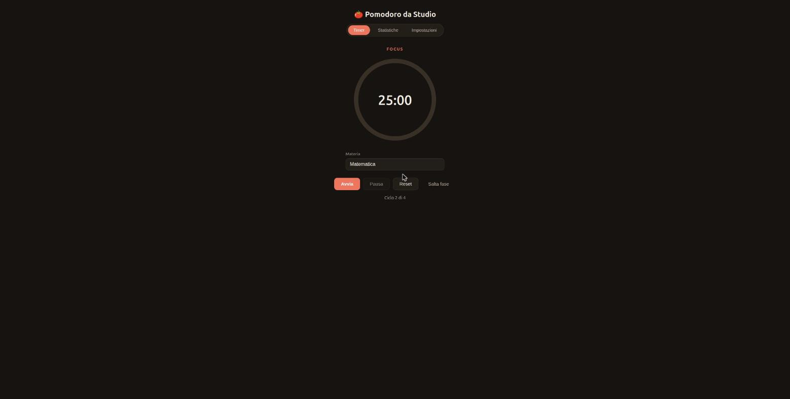
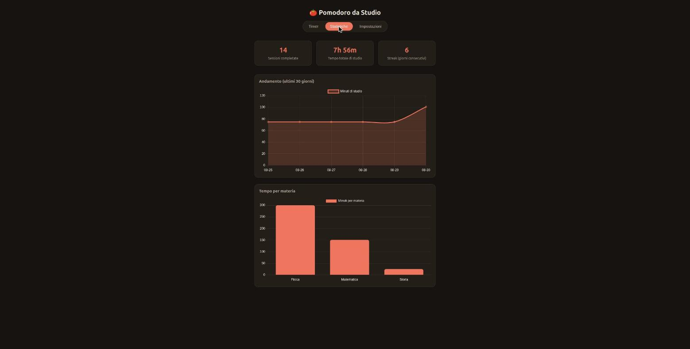

# 🍅 Pomodoro da Studio

Un timer Pomodoro personalizzabile per lo studio, con tracciamento delle sessioni, streak giornaliera e statistiche per materia. Frontend in Vanilla JS (nessun framework), backend Node.js/Express con persistenza SQLite.

## Screenshot

| Timer | Statistiche |
|---|---|
|  |  |

## Funzionalità

- Timer Pomodoro configurabile (durata focus, pausa breve, pausa lunga, numero di cicli prima della pausa lunga)
- Avvio automatico opzionale della fase successiva
- Notifiche desktop (Notification API) e suono di fine sessione (generato via Web Audio, nessun asset audio necessario)
- Tracciamento sessioni completate: numero totale, tempo totale di studio, streak di giorni consecutivi
- Statistiche per materia e per giorno, visualizzate con [Chart.js](https://www.chartjs.org/)
- Funziona anche offline: se il backend non è raggiungibile, le sessioni vengono accodate in `localStorage` e sincronizzate al primo tentativo riuscito
- Dark mode automatica (segue le preferenze di sistema)

## Stack tecnico

- **Frontend**: HTML/CSS/JavaScript puro (ES Modules), Chart.js via CDN
- **Backend**: Node.js, Express
- **Database**: SQLite via [better-sqlite3](https://github.com/WiseLibs/better-sqlite3) (nessun ORM)

## Struttura del progetto

```
PomodoroTimer/
├── backend/
│   ├── src/
│   │   ├── db/                 # connessione e schema SQLite
│   │   ├── repositories/       # query verso il database
│   │   ├── routes/             # endpoint REST (sessions, stats)
│   │   └── server.js
│   └── package.json
├── frontend/
│   ├── css/style.css
│   ├── js/                     # timer, api, notifiche, suono, statistiche
│   └── index.html
└── docs/                       # screenshot per il README
```

## Avvio in locale

Richiede Node.js 18+.

**1. Backend**

```bash
cd backend
npm install
npm run dev        # http://localhost:3001, ricrea il DB automaticamente al primo avvio
```

**2. Frontend**

In un secondo terminale:

```bash
cd frontend
npx serve -l 5500   # http://localhost:5500
```

Il frontend punta di default a `http://localhost:3001/api`. Se il backend gira su un URL diverso, puoi cambiarlo dalla schermata **Impostazioni** dell'app (viene salvato in `localStorage`).

## API Backend

| Metodo | Endpoint | Descrizione |
|---|---|---|
| `POST` | `/api/sessions` | Registra una sessione completata (`type`, `durationMinutes`, `completedAt`, `date`, `subject` opzionale) |
| `GET` | `/api/sessions` | Lista sessioni, filtrabile per `date` e `subject` |
| `GET` | `/api/stats/summary` | Sessioni totali, minuti totali, streak corrente |
| `GET` | `/api/stats/by-subject` | Minuti/sessioni aggregati per materia |
| `GET` | `/api/stats/by-day?days=30` | Andamento giornaliero |

## Deploy

- **Frontend**: qualsiasi hosting statico (GitHub Pages, Netlify, Vercel) — è una cartella di file statici, nessuna build richiesta.
- **Backend**: attenzione, `better-sqlite3` scrive su file locale. Su piattaforme serverless (es. Vercel Functions) il filesystem è effimero e i dati andrebbero persi tra un'invocazione e l'altra. Per un deploy persistente conviene un host con filesystem stabile (Render, Railway, Fly.io) impostando la variabile d'ambiente `PORT` se richiesta dalla piattaforma.

## Licenza

Distribuito con licenza [MIT](LICENSE).
